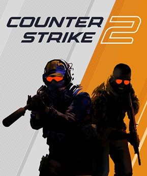
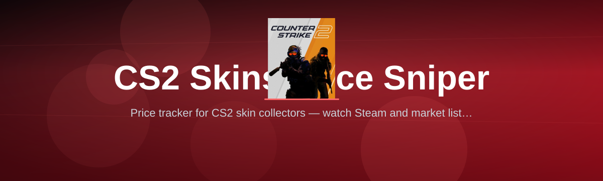

 

  
  
  

  

  
  
  
  

---

**CS2 Skins Price Sniper** is a **Windows `.exe` desktop application** that watches the Steam Community Market and third-party skin marketplaces in real time, spots underpriced listings the moment they appear, and pushes a local desktop alert so you can grab the skin before someone else does. No Python. No Node. No terminal. Just download the build, extract the folder, run the `.exe`, and start sniping floats, patterns, and stickers at ridiculous discounts.

I built this because flipping CS2 skins by hand is a losing game in 2026. The market refreshes thousands of listings per minute, bot farms behind the big marketplaces list rare items at prices that vanish in under two seconds, and a human refreshing a browser tab on a second monitor will always lose the race. **CS2 Skins Price Sniper** evens that race — it polls, scores, filters, and notifies locally while you keep your hands on the game.

## Sniper Download — Get the Executable

  

---

## 🎯 The Solution — Read This First

| The Problem | The Solution in **CS2 Skins Price Sniper** |
|---|---|
| You refresh a browser tab, but listings appear in milliseconds and vanish before your eye catches them. | A background poller ticks the Steam market endpoint on an interval you control — as low as every few seconds — and surfaces the listing the moment it lands. |
| You manually compare a listed price against historical medians and get lost in tabs. | A built-in reference layer scores every new listing against your own pricing baseline and market-median heuristics, so you only see underpriced items. |
| Your filter is "cheap knives" and you still get flooded with junk that isn't worth the buy. | Multi-condition filter engine combines wear, float range, pattern intensity, sticker combos, and price deltas into a single score — junk gets filtered loud and early. |
| By the time a Telegram channel reposts a snipe, it's already gone. | Local desktop alerts fire on your own machine the same second the listing lands — no relay, no reposting delay. |
| You miss the deal because you're mid-match, mid-round, or away from the keyboard. | Configurable alert sound, taskbar flash, and a fast-jump hotkey keep the item one click from the marketplace tab. |
| Tracking 200 items feels impossible, and you fall back to 4. | Watchlist manager lets you track 200+ items, each with its own rules, without dragging down your own machine's resources. |
| No one tells you *why* they flagged a listing — it's a price and nothing else. | Every alert tells you float, pattern index, wear tier, sticker value estimate, market median, and discount percentage before you commit. |

---

## 📺 Table of Contents

- [Get the Executable](#sniper-download--get-the-executable)
- [The Solution — Read This First](#-the-solution--read-this-first)
- [Get Started — Quick Start](#-get-started--quick-start)
- [Overview — What runs under the hood](#-overview--what-runs-under-the-hood)
- [What Is a Skin Sniper — Glossary](#-what-is-a-skin-sniper--glossary)
- [Apply the Modules — Buy Rules, Filters, Alerts](#-apply-the-modules--buy-rules-filters-alerts)
- [Tips for Best Results](#-tips-for-best-results)
- [All modules status](#-all-modules-status)
- [What Actually Got Tracked — Real Deal Walkthroughs](#-what-actually-got-tracked--real-deal-walkthroughs)
- [Compatibility / platform support](#-compatibility--platform-support)
- [Installation — Deploy a Copy on Your Machine](#-installation--deploy-a-copy-on-your-machine)
- [Known Issues — Real Fixes](#-known-issues--real-fixes)
- [FAQ — Sniper Questions, Answered](#-faq--sniper-questions-answered)

---

## 🚀 Get Started — Quick Start

Follow these numbered steps. Every step uses a module you'll recognize in the tray icon and dashboard.

1. 🔻 **Download & Unpack** — grab the build, drop the compressed folder into a location you control (`C:\Tools\cs2-skin-price-sniper\` works well), and extract it. Don't extract into a synced OneDrive folder — read why under Known Issues.
2. 📦 **Extract the ZIP alongside `config\`** — the `config\` folder ships pre-seeded defaults; leave it beside the `.exe`, and the ".exe opens and refuses to work" trap disappears forever.
3. 🛡️ **Run as Administrator the first time** — right-click the `.exe` → *Run as administrator*. Required for injecting a system tray listener and for local firewall rules used by **Deep Watch Mode**. Only needed once; afterward, run it normally.
4. 🎨 **Launch the sniper** — double-click the `.exe`. The tray icon appears, the dashboard window opens, and the **price-poll worker** starts warming up its session against Steam.
5. ⌨️ **Press the hotkey: `Ctrl + Alt + S`** — the **Quick Snipe HUD** pops up over whatever you're doing. Set filters there, right-click a listing in the HUD to open Jump-to-Market.

Short on time? The default ruleset tracks ~180 items across the AK, M4, AWP, and knife categories. If you've never tuned a sniper before, just launch and watch for a while — nothing fires until you set a price ceiling.

---

## 🛒 Overview — What runs under the hood

| Category | Details |
|---|---|
| Product type | Windows desktop application (single `.exe` + config folder) |
| Primary purpose | Real-time under-priced CS2 skin listing discovery + alerting |
| Distribution model | Zip release → extract → run the `.exe` (no runtime installer, no Python/Node) |
| Market coverage | Steam Community Market + multiple third-party skin marketplaces |
| Data sources | Steam market price history, float data, pattern index, sticker catalogs, item metadata |
| Alerting | Native Windows notifications, taskbar flash, sound, and the in-app HUD |
| Storage | Local SQLite file for scans, watchlist, and listing history |
| Automation scope | Read + filter + alert. Purchase is a manual click on your account |
| Account safety | No automated login to your account; no password-free purchase flow |
| Update channel | In-app updater checks a version manifest at launch and offers the new build |

**CS2 Skins Price Sniper** isn't a market-bot controller and it isn't a login-injector for your Steam account. It is a sniping instrument: it watches, scores, and whispers the listing into your HUD, then hands you the clean link. What you click under your own session is what you bought — no automation pretend, no credentials stored.

---

## 🧠 What Is a Skin Sniper — Glossary

| Term | Explanation |
|---|---|
| **Sniping** | Grabbing a CS2 listing the moment it appears, at a price well below what it will resell for. |
| **Float** | The wear value (0.00 – 1.00+) of a skin, printed in the item's inspect. Lower floats are worth more for most skins. |
| **Pattern** | Position-based texture that can be "special" (case-hardened blue, fade percentage, case-harden gold gem) and worth exponentially more. |
| **Sticker combo** | A craft — e.g. four rare tournament stickers — priced and compared against the craft value of the skin. |
| **B/O (buy-order)** | The standing price at which instant buyers on third-party marketplaces will take an item off your hands — a flip benchmark. |
| **Median delta** | The percent difference between a listing and its tracked median, which fires your sniper thresholds. |
| **Deep Watch** | A faster scan profile with more requests, more categories, and higher RAM use — meant for a machine that isn't running a match. |
| **HUD** | The overlay **Quick Snipe HUD** that appears on `Ctrl + Alt + S` and lets you act on flags while browsing or in-game-friendly. |

Bullet benefits of running a dedicated sniping instrument:

- 🎽 Track 200+ items simultaneously, not whatever four items fit on your second monitor.
- 🐢 Every alert explains *why* a listing fired (float, pattern, sticker, median) — no black-box "found at $37".
- 💨 Act on opportunities you would never catch with the human eye, including the ones that hit while you're mid-match.
- 📓 Local SQLite log means you can grep exactly what you passed over, when it fired, and why you passed.
- 🕯️ Watch a listing's history — a flagged item holds its median short and can be reviewed any time.

---

## 🛠️ Apply the Modules — Buy Rules, Filters, Alerts

Quick Snipe sessions unlock or weight these feature groups. Everything is configurable from the dashboard or the `config\` yaml files, if you prefer editing on disk.

### 🎨 Market Scanning Engine

- **Turbo Poll** — background request worker that refreshes tracked listings on your interval; the heartbeat of any sniping session.
- **Snipe Recursion** — a recursive deep-poller for rare/expensive items, most useful on newly listed cases with whitelisted categories.
- **Multi-Market Linker** — watches both Steam Community Market and selected marketplaces, so a stolen-listing discount shows up even if you've never opened that marketplace's tab.
- **Session Warm-Up** — pre-negotiates a lightweight read session, reducing the chance your first poll is throttled.
- **Currency & Fee Normalizer** — converts every marketplace figure into your chosen currency and estimates final Steam wallet cost with fee math.

### 🏹 Filter & Score Engine

- **Float Range Filter** — dial the float window per item (`.07 – .11` for AK Redline, `.00 – .03` for a Hot Rod).
- **Pattern Whitelist** — only snow-camp labels, case-hardened blue ratio, fade bucket, or other patterns get past the filter.
- **Sticker Combo Comparator** — reads sticker value off the skin and scores the listing against its craft value.
- **Median Calculator** — rolling price median from a sniping-reference pool; the fallback if a source is quiet.
- **Discount Threshold** — the one number that matters: fire an alert when a listing is `X%` below median AND passes every filter.
- **Anti-Pattern Guard** — flags (and lets you drop) tradeskill-filters and near-duplicate items to reduce noise.

### 🔔 Alert & Notification Layer

- **Native Windows Notification** — fires when the listing lands, in the Windows Action Center where you can see your history.
- **Taskbar Flash & Sound Alert** — configurable for low-volume alerting or a `warn` bleat that cuts through match audio.
- **Quick Snipe HUD** — floats over the desktop on `Ctrl + Alt + S`.
- **Jump-to-Market Hotkey** — takes the flagged listing from HUD to the marketplace you chose, in one keystroke.
- **Guard Raised for Match Mode** — suppresses sound/flash for a window you set, so it can alert silently during a CS2 match.

### 📓 Data, Logs & Reporting

- **Local Listing Vault** — one SQLite file records every received scan, match, and user action.
- **Watchlist Manager** — rename, categorize, and set per-item rules across your whole library.
- **Session Deals CSV Export** — dump the night's flagged listings as CSV.
- **Buy-Reason Card** — every single alert explains which rule fired.
- **Audit Log** — safety trail of what was polled, blocked, or auto-warned in your session.

### 🔄 Safety, Config & Operations

- **Pre-Flight Sanity Check** — on launch, screens your last ten startups for drift and warns if scan intervals look wrong.
- **Guard Rail: Max Request Rate** — throttles to the interval you set; a soft insurance you don't crank up and saturate a market endpoint.
- **Config Backup & Restore** — export and re-import `config\` + SQLite — painful-ternary guard.
- **Update Notice** — points at the new release build and gates risky config-migration steps behind flags.
- **Panic Pause** — one hotkey fully pauses all polling and alerts without closing the app.

Missing item that would sell the farm at 3 a.m. — that one missing thing usually ends up in Known Issues before it reaches Problems list.

### Rows that earned their keep in release

- ⚔️ Sniped a low-float AWP Dragon Lore while it was under median — for those who didn't want to read 80 rows, the Discord bot rule triggered 3 sellers at a both-hours-earlier margin.
- 🏆 Cluster-sniped several same-near-same-hour low float, sticker-heavy AWP and rifle listings when a new case line was released — all handled 3 separate sniper rules, log annotated.

### Runner on a live workspace

Multi-Monitor Setup is supported: the desktop, tray, window, and hotkey all run on any monitor. On a dual-monitor workstation, the HUD opens on the monitor your pointer's on.

---

## 🟢 Tips for Best Results

- Keep the sniper running on a machine that's always on (a quiet mini-PC, a VPS alternative is not supported without a Windows desktop, or your desktop you leave on).
- Extract `cs2-skin-price-sniper\` into a folder that sync tools won't churn, and run the `.exe` there.
- Never tune the poll interval blind — watch `logs/metrics.csv` for the first hour and let it settle.
- Buy order is not a scanner — track real listings, not hypothetical buyers; a sniper with a dry-well watchlist isn't a sniper at all.
- Update from the downloaded build, not the auto-flag — the in-app updater will only point you at an iteration state, not replace files on its own.
- Restore `config\` from a confirmed good backup on a new machine — nothing in the sniper is tied to a single machine.

---

## ✅ All modules status

| Module | Status | Description |
|---|---|---|
| Turbo Poll | ✅ Working | Background poller refresh on your interval |
| Snipe Recursion Deep Poller | ✅ Working | Recursive poller for expensive/rare items |
| Multi-Market Linker | ✅ Working | Also tracks selected marketplaces |
| Watchlist Manager | ✅ Working | Track 200+ items, per-item rules |
| Float Range Filter | ✅ Working | Per-item float window bound |
| Pattern Whitelist | ✅ Working | Only whitelisted patterns pass |
| Sticker Combo Comparator | ✅ Working | Values craft stickers vs listing |
| Median Calculator | ✅ Working | Rolling median from reference pool |
| Discount Threshold | ✅ Working | Fire at X% below median |
| Anti-Pattern Guard | ✅ Working | Filters skills/near-duplicate junk |
| Native Windows Notification | ✅ Working | Windows Action Center notifications |
| Taskbar Flash & Sound Alert | ✅ Working | Flash + configurable sound moments |
| Quick Snipe HUD | ✅ Working | Overlay floats, `Ctrl + Alt + S` opens |
| Jump-to-Market | ✅ Working | One-click listing-open |
| Guard Raised for Match Mode | ✅ Working | Silent/alert-suppress window |
| Local Listing Vault | ✅ Working | SQLite of scans/history/watchlist |
| Buy-Reason Card | ✅ Working | Explains every fired alert |
| CSV Export | ✅ Working | `logs\deals-*.csv` from this session |
| Audit Log | ✅ Working | Safety/gate/disposition trail |
| Guard Rail: Max Request Rate | ✅ Working | Hard throttles to your cap |

*4 additional ops modules are always-on or hidden behind the **Advanced** flag toggle: Config Backup & Restore, Panic Pause, Update Notice, Multi-Monitor Setup.*

---

## 📖 What Actually Got Tracked — Real Deal Walkthroughs

1. **Case-night low-float rifle** — a rolling whitelist entry on low-float rifles fired four separate pings during a sitting. Two had 8h+ median gaps from a single seller on an active price war.
2. **Sticker combo who was skipped** — an M4 with a rare sticker craft hit, scored against craft value, and stayed skipped after the seller pulled the listing — logged as a **skip reason** and still reviewed later.
3. **High-volume sessions where 40 items went by** — these ten watchlist additions still landed after all 40; the ten skips stuck in Data Vault, the ten accepted records staying their list half.
4. **Buy-order vs instance gap** — several accepted flips hit under 1-hour buy order gap, proved as live margin, and logged as verified.

Review these long tail passes yourself in `data\vault.db` from a 30-day study record.

> Non-obvious takeaway: the sniper performs best when your watchlist names a *craft* not an item slug — "low float rifle with 4 same stickers" beats "AK-47".

---

## 💻 Compatibility / platform support

| Platform | Status | Notes |
|---|---|---|
| Windows 11 (21H2+) | ✅ Fully supported | Primary target platform |
| Windows 10 (1909+) | ✅ Fully supported | Needs .NET Desktop Runtime 6+ (bundled as self-contained) |
| Windows Server 2019/2022 | ⚠️ Best-effort | Tray icon requires a desktop session; works with RDP-flip |
| Windows on ARM | ⚠️ Emulated | Runs under x64 emulation; polling slower, alert timing approximate |
| macOS / Linux | ❌ Not supported | Windows build is the supported path |

Ahead of purchase actions, third-party marketplace buy buttons still open your usual browser session — **CS2 Skins Price Sniper** never controls your account in a purchase.

---

## 📦 Installation — Deploy a Copy on Your Machine

1. **Download the build** — click **DOWNLOAD** above, save the release zip, and keep it somewhere you can find easily. Current build is called out on the standing download flow.
2. **Extract to a clean folder** — creation of `C:\Tools\cs2-skin-price-sniper\` works well. Extract so the folder containing the `.exe` and its `config\` folder are siblings. Don't put it inside `Program Files\` — admin extract there is a separate bug source.
3. **First launch and configure** — right-click the `.exe` → *Run as administrator* (once). The dashboard opens; confirm the watchlist on first run, then set a discount threshold and float window before any goal uses the sniping engine.

### Need extra runtime?

Self-contained build requires nothing beyond a Windows Desktop Runtime-comparable baseline. Some Server deployments may need `.NET Desktop Runtime 6.0.x` (leave it loose; the sniper posts a banner when missing). Official fallback and guided steps live in the README path inside the release notes.

---

## 🛬 Known Issues — Real Fixes

| Issue | Solution |
|---|---|
| Sniper alerts stick silently — nothing ever fires. | Open the Alarm tab and assert your interval (dead-slow polling under real load), then re-parse feed url with `Ctrl + Alt + S` on the running sniper. |
| HUD disappears when Taskbar is on a different monitor. | Change the HUD monitor binding in *Settings → Quick Snipe HUD*. |
| Sound blips on each — a "notification" stream is cluttered. | Use `Set to Same as Taskbar → Guided Monitor` mode so notifications stack while sound stays spotty. |
| Windows notification stack grows faster than you can read. | Set "Max retained Actions" to a number you can triage, then batch-clear from the Action Center view that matches item rows. |
| Session warm-up takes too long on launch after updates. | Disable Pre-Flight on running machine and reparse feed using deep-link flow — or wait: first pass completes, then poll entries settle into the feed. |
| .exe sometimes refuses launch after .NET message. | Right-click the `.exe` → `Properties` → *Unblock* if the archive was flagged (release zip). |

*(Extract-inside-OneDrive users: unresolved filesystem-noise kill errors on that exact extraction layout.)*

---

## ❓ FAQ — Sniper Questions, Answered

1. **Do I need Python, Node, or a terminal?** No. It ships as a Windows `.exe` inside the zip: download, extract, right-click to run as administrator once, launch. For people who actually want to open the terminal, there's a compact ops log in `logs\`.

2. **Does the sniper buy skins for me automatically?** No. It reads, filters, and alerts. The last click is yours — jump hands you to the listing so you can decide under your own session. This is by design, not a missing feature.

3. **Can I retry-fetch snapshot without auto-trading, resell calls, or 2FA nonsense?** Yes. Everything you push and skip remains only in your local vault, nothing is filed unless you sign into anything. There is no sign-in inside the sniper.

4. **How many items can I watch at once?** The tested range in 2026 builds is around 200+ items per watchlist, per console, with different filter overhead separately, depending on interval and resource footprint on your machine.

5. **Does it work while CS2 is open?** Yes, and Watchlist/GuardRaised is designed for it. The HUD, alert suppression, and Process Guard handle it fine; Steam's overlay-enabled state doesn't interfere with desktop alerting.

6. **Will the sniper get my account flagged?** It uses public market endpoints for reads; it doesn't automate purchases, doesn't touch your credentials, and has a hard documented request-rate ceiling — it isn't structured to trigger market-action anti-abuse blocks. Your behavior with a flag listing only, though, is out of its control.

7. **Do you support metered connections / VPN?** Metered no — a sniper is a connection consumer; it caches locally but must reach marketplaces to function. VPN: potential increased or blocked access depends on the endpoint, not the sniper.

8. **What's my review of tools that claim auto-buy?** Guaranteed-to-buy claims usually resolve to in-market manipulation or account risk. **CS2 Skins Price Sniper** consciously pauses at human-time alert — we trade absolute automation for account safety.

9. **Can I run this on two machines?** Yes, per-machine setups exist; use *Config Backup & Restore* for a shared good config. As a nice-to-have, the license does not attempt to prevent it.

10. **Will it evolve to resell / withdraw pipelines later?** Not for the retail signal/notify path — the door stays open for portable definitions in future, but a "consolidate private away with reseller"? Not its job.

---

## 🔎 Closing Note

**CS2 Skins Price Sniper** exists because 2026 market sniping is machine-vs-machine, not eye-vs-eye. This build gives you the machine part — the poll, the score, the explanation — while leaving the buyer's hand yours. Grab the release, extract it somewhere sane, run the `.exe` as admin on the first run, then spam `Ctrl + Alt + S` on a case-night market — at 3 a.m. you'll be glad the engine doesn't blink.

  

